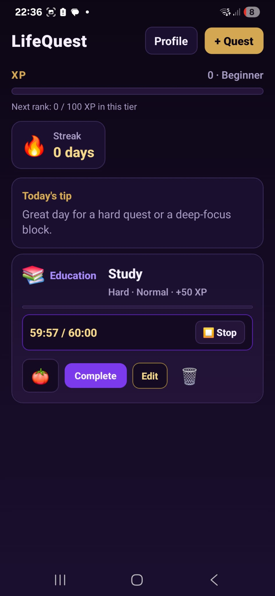
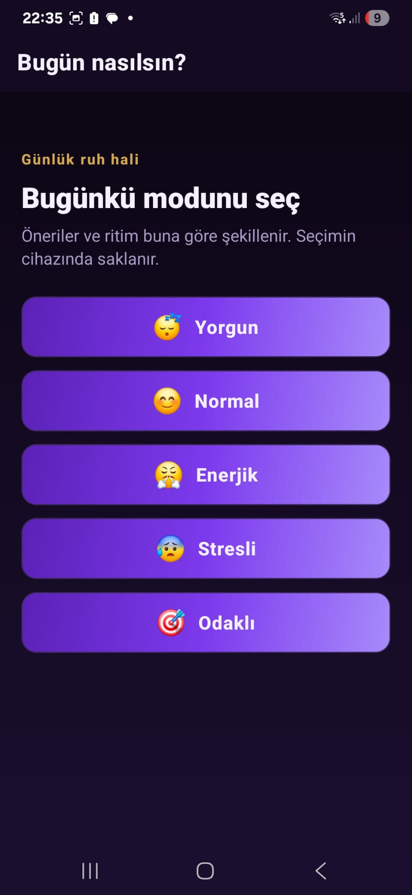
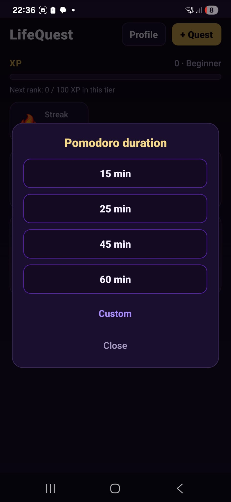
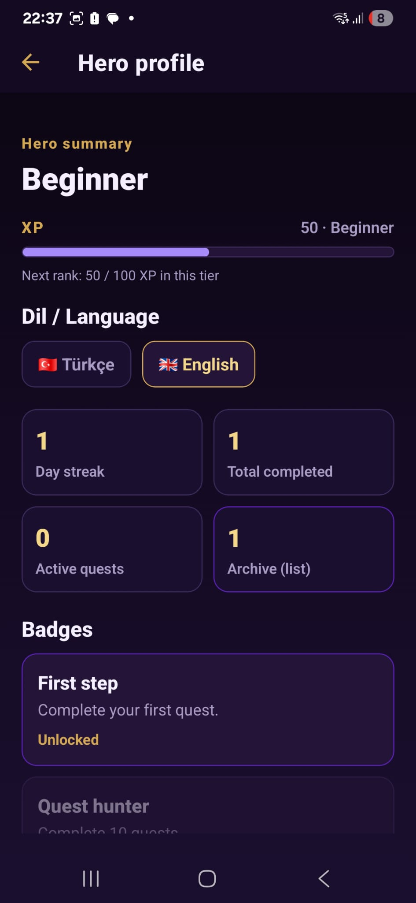

# 🎮 LifeQuest — Gamified Task Manager

An RPG-style productivity app that turns your daily tasks into quests. Earn XP, level up, maintain streaks, and unlock badges as you complete your goals.

## 📷 Screenshots






## ✨ Features
- 🗡️ Quest system with difficulty levels (Easy / Medium / Hard)
- ⚡ XP & leveling system (Beginner → Explorer → Warrior → Legend)
- 🔥 Daily streak tracking
- 🍅 Customizable Pomodoro timer (15 / 25 / 45 / 60 min + custom)
- 😴 Daily mood tracking with personalized tips
- 🏆 Badge system (First Step, Quest Hunter, Warrior rank...)
- 📦 Offline-first — all data stored locally with AsyncStorage
- 🌍 Turkish & English language support

## 🛠️ Tech Stack
- React Native
- Expo SDK 54
- TypeScript
- AsyncStorage
- React Navigation

## 🚀 Getting Started
```bash
git clone https://github.com/FatihEmreBARUTCU0/-LifeQuest
cd -LifeQuest
npm install
npx expo start
```
Then scan the QR code with Expo Go app on your phone.
